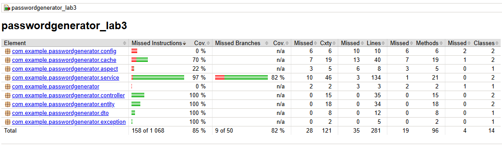
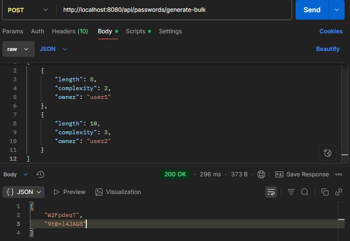

Веб-приложение для генерации и управления паролями с тегами. Использует PostgreSQL, BCrypt для шифрования, Spring Security для доступа, кэширование и CRUD-операции.

1. Добавить POST метод для работы со списком параметров (передаются в теле запроса) для bulk операций, организовать работу сервиса используя Java 8 (Stream API, лямбда-выражения).
2. Покрытие Unit-тестами на >80% (бизнес-логика).

